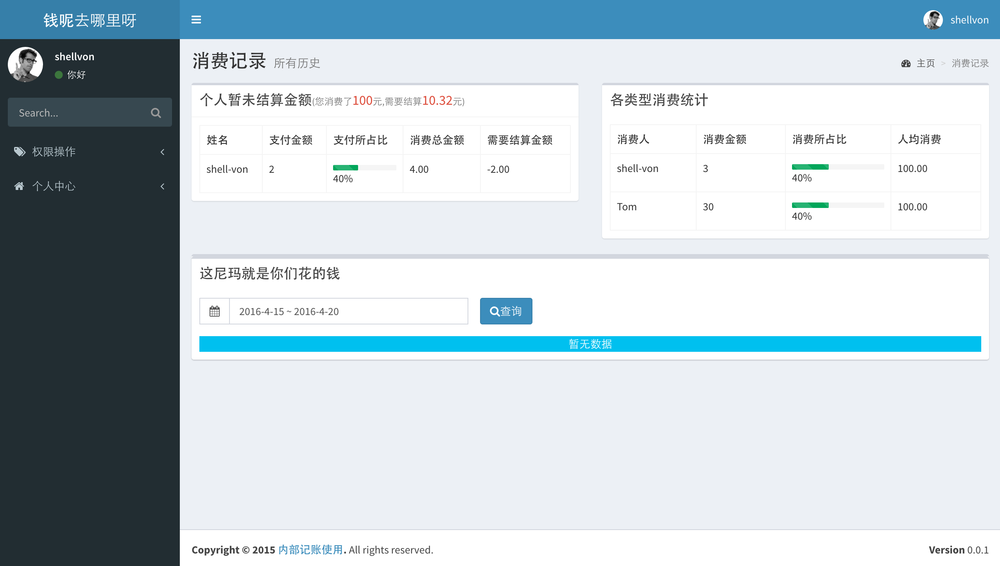
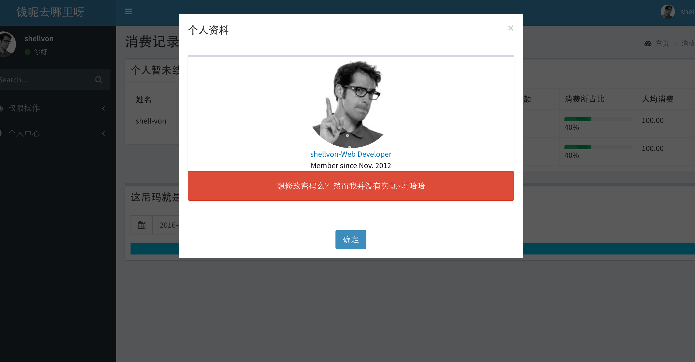

#MicroMoney

和室友记账使用的简单的Web程序.

依赖的技术有

+ MicroMan框架(-_-# 你没看错,就是Microman里面写的那个单文件,我人生第一个MVC框架...)
+ AdminLTE模版,正在接入.
+ WebSocket  (如果要加入和室友聊天的话....)

##效果图.

##Change Logs

+ 2016-4-14 创建该项目,实现MicroMan原型.
+ 2016-4-15 导入AdminLTE支持.增加MicroTemplate/Utility支持.
+ 2016-4-16 加入数据库支持,增加MicroDatabase
+ 2016-4-19 完成CRUD基础功能。

##简单说明

1. 搭建PHP-FPM+Nginx配置环境，Nginx配置文件例子见[microman.conf](./microman.conf)
2. 在`App/Config`目录下修改自己的Database配置，并且导入`_res`目录下的[init.sql](./_res/int.sql)文件。
3. 修改自己host配置（如果你nginx配置了server name的话）为你喜欢的域名(和nginx中servername保持一致)
4. 打开浏览器可以看效果。

###To be continue.