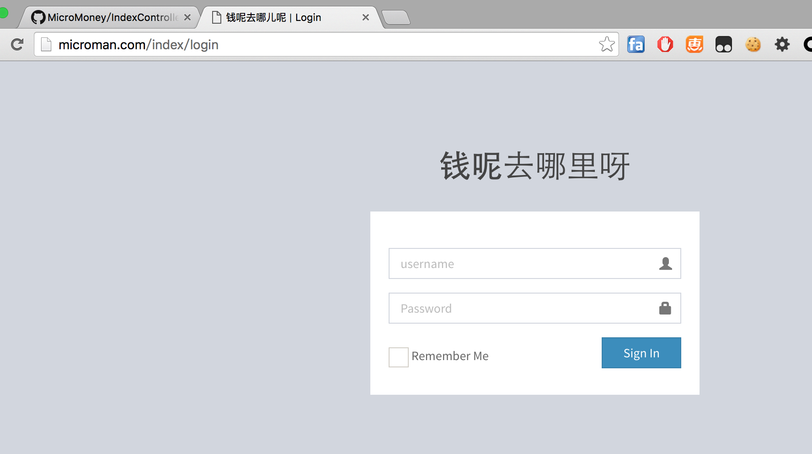

#MicroMoney

和室友记账使用的简单的Web程序.

依赖的技术有

+ MicroMan框架(-_-# 你没看错,就是Framework里面写的那个文件,我人生第一个MVC框架...)
+ AdminLTE模版,正在接入.
+ WebSocket  (如果要加入和室友聊天的话....)

##登录界面截图

##主页截图.

##Change Logs

+ 2016-2-14 创建该项目,实现MicroMan原型.
+ 2016-2-15 导入AdminLTE支持.增加MicroTemplate/Utility支持.
+ 2016-2-16 加入数据库支持,增加MicroDatabase

##To be continue.